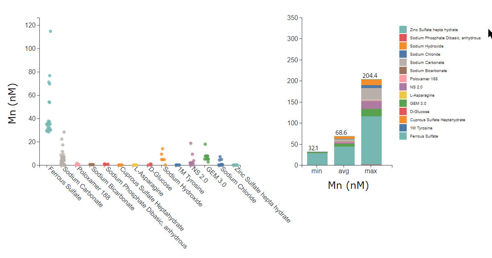

# material-component-analysis
port of my 2022 project with reactive d3 scatter and bar charts, analyzing trace components contained in 1000s of sampled vendor lots. in-progress (need to strip sensitive information).
## visualizations
each request generates ~16x2 plots that fill the page. each of the plots are interactable. 

 
